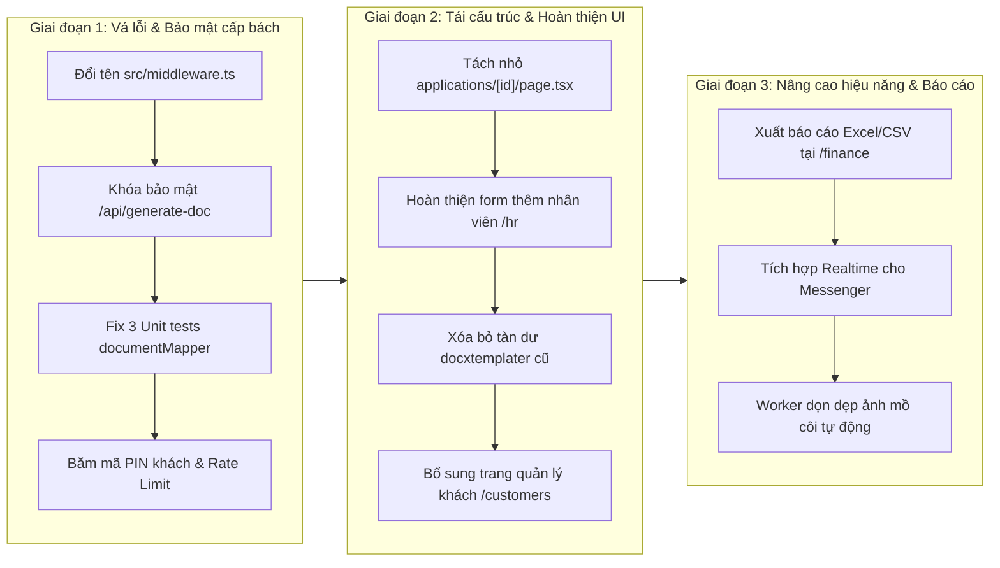

# BÁO CÁO RÀ SOÁT VÀ ĐÁNH GIÁ TOÀN DIỆN DỰ ÁN NENKINPRO
**Hệ thống Quản lý và Xử lý Hoàn thuế Lương hưu Nhật Bản (年金脱退一時金)**

> **Ngày lập báo cáo:** 19/09/2026  
> **Người thực hiện:** AN (AI Tech Lead / Architecture Auditor)  
> **Phiên bản mã nguồn:** Next.js 16.2.6 / Prisma 7.8 / PostgreSQL (Supabase)  
> **Trạng thái tổng quan:** **Hoạt động tốt ở các luồng cốt lõi, nhưng có một số lỗi kiểm thử, lỗ hổng bảo mật và nợ kỹ thuật cần xử lý gấp.**

---

## 1. TỔNG QUAN HỆ THỐNG & ĐÁNH GIÁ MỨC ĐỘ TRƯỞNG THÀNH (HEALTH SCORE)

### 1.1. Mục tiêu và Nghiệp vụ cốt lõi
NenkinPro là nền tảng quản lý quy trình hoàn tiền Nenkin và hoàn thuế thu nhập cho người lao động, thực tập sinh, kỹ sư Việt Nam rời Nhật Bản về nước. Quy trình nghiệp vụ trải qua 2 chặng hành chính bắt buộc:
1. **Lần 1 (Bảo hiểm xã hội 80%):** Nộp biểu mẫu *脱退一時金請求書* (kèm Hộ chiếu, Thẻ ngoại kiều, Sổ Nenkin, Tài khoản ngân hàng) tới Cục BHXH Nhật Bản (*Japan Pension Service*). Nhận tiền 80% giải ngân trực tiếp vào tài khoản ngân hàng của khách tại Việt Nam/Nhật Bản.
2. **Lần 2 (Thuế thu nhập 20.42%):** Khi Lần 1 hoàn tất, Cục BHXH khấu trừ 20.42% thuế thu nhập và gửi *Phiếu thông báo quyết định chi trả (脱退一時金支給決定通知書)*. Đơn vị dịch vụ nộp hồ sơ xin hoàn 100% số thuế này thông qua *Người đại diện nộp thuế (納税管理人)* gửi tới Cục thuế địa phương (*Tax Office - 税務署*), tính thuế lũy tiến hưu trí (Bảng 3, Bảng 1-2, Tờ khai khấu trừ), nhận tiền hoàn thuế và quyết toán phí dịch vụ cho khách hàng.

### 1.2. Bảng điểm sức khỏe dự án (Health Score)

| Tiêu chí | Điểm (Thang 100) | Đánh giá | Trọng tâm cần lưu ý |
| :--- | :---: | :--- | :--- |
| **Kiến trúc & Công nghệ** | **82/100** | Khá tốt | Stack hiện đại (Next.js 16, React 19, Tailwind v4, Prisma, Supabase). Tuân thủ tốt quy tắc chống treo máy trên Windows. |
| **Nghi nghiệp vụ Nenkin & Thuế** | **90/100** | Xuất sắc | Đã số hóa đầy đủ công thức tính thuế hưu trí Nhật, tách số vào ô PDF, tự động xác định Cục thuế NTA qua mã bưu điện. |
| **Mức độ hoàn thiện UI/UX** | **85/100** | Khá tốt | Áp dụng chuẩn High-Density UI, hỗ trợ Mobile-first, Workspace 3 panel mượt mà. |
| **Bảo mật & Phân quyền** | **60/100** | **CẢNH BÁO** | File middleware Next.js bị sai tên không hoạt động; IDOR tại endpoint tạo PDF; PIN khách hàng lưu plaintext. |
| **Chất lượng mã & Kiểm thử** | **68/100** | **CẦN SỬA** | 3 Unit Tests đang bị Fail do lệch hợp đồng dữ liệu số tiền; File `applications/[id]/page.tsx` quá lớn (4,097 dòng). |

---

## 2. MA TRẬN ĐÁNH GIÁ CHI TIẾT TỪNG PHÂN HỆ & TÍNH NĂNG

### 2.1. Phân hệ Tiếp nhận hồ sơ & Khách hàng mới (`/onboarding`) — **Hoàn thiện 85%**
- **Điểm mạnh:**
  - Quy trình wizard từng bước rõ ràng, thân thiện trên cả điện thoại và máy tính.
  - Tích hợp camera chụp tài liệu trực tiếp, hướng dẫn người dùng căn khung ảnh rõ nét.
  - Tích hợp OCR AI tự động bóc tách thông tin Thẻ Ngoại kiều (mặt trước/sau), Hộ chiếu, Sổ Nenkin, Ngân hàng.
  - Tự động tra cứu và chuẩn hóa mã bưu điện qua Zipcloud / ExcelAPI và tự động suy luận Cục thuế quản lý NTA.
  - Có tính năng phát hiện trùng lặp hồ sơ thông minh (Duplicate Check) qua số thẻ ngoại kiều / số điện thoại.
- **Tồn tại & Vấn đề:**
  - **Mã PIN khách hàng mặc định `123456`:** Khi khách đăng ký, hệ thống tự động cấp PIN `123456` và lưu dạng plaintext trong database. Khách hàng chưa đổi PIN có nguy cơ bị người khác tra cứu hồ sơ nếu biết số điện thoại.
  - **Dữ liệu ảnh nháp (Anonymous Uploads):** Ảnh tải lên trong quá trình onboarding lưu vào thư mục `anonymous/` hoặc `draft_.../` chưa có worker quét và dọn rác tự động nếu khách bỏ dở giữa chừng.

### 2.2. Phân hệ Workspace Chi tiết Hồ sơ (`/applications/[id]`) — **Hoàn thiện 90%**
- **Điểm mạnh:**
  - Layout 3 panel độc lập cuộn mượt mà theo đúng PRD Phase 3:
    * Panel trái: Bộ sưu tập chứng từ, zoom lightbox, crop ảnh, trigger OCR bóc tách tại chỗ.
    * Panel giữa: Form nhập liệu ngữ cảnh (Contextual form) thay đổi linh hoạt theo tài liệu đang chọn.
    * Panel phải: Tiến độ workflow, ngày xử lý, tài chính (tỷ giá, phí 20%, hoa hồng CTV, giảm giá), thông tin Cục thuế và Người đại diện thuế.
  - Tính năng **Checklist đối chiếu (Verification Checklist)** với cơ chế tự động hủy dấu tích xanh khi nhân viên chỉnh sửa trường thông tin.
  - Tính thuế hưu trí lũy tiến tự động theo Luật thuế Nhật Bản (khấu trừ hưu trí 40 vạn yên × số năm, tính 5% - 45% + 2.1% thuế phục hồi).
- **Tồn tại & Nợ kỹ thuật nghiêm trọng:**
  - **File Monolith 4,097 dòng (249 KB):** File `src/app/applications/[id]/page.tsx` chứa toàn bộ mã nguồn của cả 3 panel, các modal phụ, crop image, diff panel. Điều này làm tăng thời gian biên dịch, khó bảo trì và dễ gây ra bug ngoài ý muốn khi sửa chữa.
  - Cần chia tách (refactor) file này thành các sub-components: `DocumentViewerPanel.tsx`, `ContextualFormPanel.tsx`, `WorkflowFinancePanel.tsx`.

### 2.3. Phân hệ Xuất biểu mẫu & In ấn PDF (`/admin/pdf-mapper`, `/api/generate-doc`) — **Hoàn thiện 80%**
- **Điểm mạnh:**
  - Công cụ **PDF Mapping Studio** kéo thả trực quan trên trình duyệt, cho phép hiệu chỉnh tọa độ `(x, y)`, font size, độ dày đường kẻ trực tiếp trên nền PDF gốc.
  - Đã lập bản đồ tọa độ cho 5 biểu mẫu cốt lõi:
    1. `don_xin_lan_1.pdf` (Đơn xin Lần 1 - 2 trang)
    2. `ininjyo_yoshiki_lan_1.pdf` (Giấy ủy quyền Lần 1)
    3. `nouzeikanrinin.pdf` (Người đại diện nộp thuế Lần 2)
    4. `bang_1_2.pdf` (Bảng 1 và 2 tờ khai thuế)
    5. `bang_3.pdf` (Bảng 3 tờ khai thuế tách rời)
  - Tự động chuyển đổi niên hiệu Nhật Bản (*Reiwa, Heisei, Showa*), tách từng chữ số vào từng ô vuông (digit splitting).
- **Lỗi & Tồn tại:**
  - **Lỗi Unit Test đang trượt (3 failed tests)** trong `documentMapper.test.ts` và `pdf-render-contract.test.ts`.
  - Vẫn tồn tại mã nguồn cũ `docxtemplater` (`/api/generate-form` và các file `.docx` trong `public/templates/`). Cần xóa bỏ để thống nhất 100% sang PDF overlay.
  - Thiếu quy trình Review & Publish chính thức cho Template Draft (mới chỉ lưu draft vào DB).

### 2.4. Phân hệ In tem thư & Bì thư bưu điện (`/address-labels`) — **Hoàn thiện 95%**
- **Điểm mạnh:**
  - Cung cấp giải pháp in ấn nhãn dán bưu điện hoàn chỉnh cho 3 đối tượng: Người đại diện thuế, Cục thuế quản lý và Cơ quan Nenkin Nhật Bản.
  - Đầy đủ các layout khổ A4 chuẩn công nghiệp: 3x6 (18 nhãn/trang), 2x5 (10 nhãn/trang), 2x6 (12 nhãn/trang).
  - Tự động gắn kính ngữ tiếng Nhật chuẩn xác (*様 cho cá nhân, 御中 cho cơ quan/Cục thuế, 行 cho bì thư gửi lại*).
  - Hỗ trợ in trực tiếp với đường kẻ hướng dẫn cắt (cut lines) và căn chỉnh tỷ lệ in 100% không bị lệch lề.

### 2.5. Phân hệ Cổng thông tin khách hàng (`/customer/portal`) — **Hoàn thiện 85%**
- **Điểm mạnh:**
  - Giao diện tra cứu tiến độ độc lập dành riêng cho khách hàng.
  - Cho phép khách xem trạng thái từng giai đoạn (Lần 1, Lần 2), số tiền dự kiến, tiền thực nhận, tài khoản ngân hàng.
  - Có tính năng đổi mã PIN bảo mật.
  - Nhân viên có thể preview giao diện portal của khách thông qua cơ chế Staff Preview an toàn.
- **Tồn tại:**
  - Mã PIN xác thực hiện chưa được mã hóa băm một chiều (Hash).

### 2.6. Phân hệ Quản lý Tài chính & Tỷ giá (`/finance`) — **Hoàn thiện 85%**
- **Điểm mạnh:**
  - Tự động cào tỷ giá JPY/VND thời gian thực từ DCOM Money Express.
  - Biểu đồ biến động tỷ giá (Recharts) và lưu trữ lịch sử tỷ giá theo ngày.
  - Tính toán chi tiết: Phí dịch vụ 20%, Tiền quy đổi VND, Hoa hồng CTV (2,000 JPY), Giảm giá khách giới thiệu (2,000 JPY).
  - Cung cấp sẵn mẫu tin nhắn soạn sẵn chuyên nghiệp để nhân viên gửi cho khách hàng và CTV qua Zalo/Facebook.
- **Cần cải thiện:**
  - Chưa có nút xuất báo cáo tài chính toàn diện ra định dạng Excel/CSV cho bộ phận kế toán.

### 2.7. Phân hệ Quản lý Nhân sự (`/hr`) — **Hoàn thiện 40% (Chưa hoàn chỉnh)**
- **Điểm mạnh:**
  - Danh sách nhân viên lấy từ database qua API `GET /api/hr/staffs` (có kiểm tra quyền `ADMIN`).
- **Lỗi & Thiếu sót nghiêm trọng:**
  - **Form "Thêm Nhân sự mới" là UI rỗng (Dead form):** Không có logic submit (`onSubmit={(e) => e.preventDefault()}`), các ô input không gán state, nút "Lưu Nhân sự" không gửi dữ liệu.
  - Backend chưa có API `POST /api/hr/staffs` để tạo nhân viên mới.
  - Nút thao tác ba chấm chưa có menu để sửa thông tin, khóa tài khoản hoặc reset mật khẩu nhân viên.

### 2.8. Phân hệ Messenger Chat & AI CSKH (`/messenger`, `FloatingAiChat.tsx`) — **Hoàn thiện 80%**
- **Điểm mạnh:**
  - Trợ lý AI khách hàng thông minh: Sử dụng kiến trúc Hybrid (ưu tiên trả lời từ điển offline 0ms, chỉ gọi Gemini 2.5 Flash khi gặp câu hỏi phức tạp), tiết kiệm 90% chi phí và hạn chế tối đa lỗi quota API.
  - Messenger phân chia rõ ràng các tab: Khách hàng, CTV, Chat nhóm, Lưu trữ. Hỗ trợ tạo nhóm chat và gửi ảnh đính kèm.
- **Cần cải thiện:**
  - Messenger sử dụng cơ chế Polling (gọi API chu kỳ vài giây) thay vì WebSocket hay Supabase Realtime, có thể gây tải server khi số lượng người dùng đồng thời tăng cao.

---

## 3. CÁC LỖI KỸ THUẬT VÀ LỖ HỔNG BẢO MẬT CẦN XỬ LÝ NGAY

### 🚨 LỖ HỔNG 1: Next.js Middleware bị vô hiệu hóa hoàn toàn (Fatal Route Bypass)
- **Vị trí:** `src/proxy.ts`
- **Mô tả:** Tệp bảo vệ định tuyến của dự án được đặt tên là `src/proxy.ts`. Trong Next.js App Router, file middleware bắt buộc phải được đặt tên là `middleware.ts` (ở root hoặc trong `src/middleware.ts`). Vì đặt tên sai, Next.js hoàn toàn bỏ qua file này trong chu trình xử lý request.
- **Hậu quả:** Toàn bộ logic chặn người dùng chưa đăng nhập vào các trang nội bộ (`/applications`, `/hr`, `/finance`, `/messenger`, `/settings`) ở tầng edge server đều không hoạt động.
- **Biện pháp khắc phục:** Đổi tên file từ `src/proxy.ts` thành `src/middleware.ts` và kiểm tra lại danh sách route whitelist.

### 🚨 LỖ HỔNG 2: IDOR / Thiếu xác thực tại API xuất PDF (`/api/generate-doc`)
- **Vị trí:** `src/app/api/generate-doc/route.ts` (dòng 9-35)
- **Mô tả:** Endpoint nhận `applicationId` và xuất file PDF chứa đầy đủ thông tin nhạy cảm của khách hàng (họ tên, ngày sinh, số thẻ ngoại kiều, số hộ chiếu, tài khoản ngân hàng, lịch sử công ty). Tuy nhiên, endpoint này **không có bất kỳ lời gọi xác thực nào** (`requireStaff()` hoặc `requireCustomerAccess()`).
- **Hậu quả:** Bất kỳ ai trên internet nếu biết hoặc đoán được mã UUID của hồ sơ đều có thể gửi request POST và tải toàn bộ hồ sơ PDF của khách hàng.
- **Biện pháp khắc phục:** Bổ sung `await requireStaff()` hoặc `await requireApplicationAccess(applicationId)` ngay đầu hàm POST.

### 🚨 LỖ HỔNG 3: Mã PIN khách hàng lưu Plaintext & Không có Rate Limit
- **Vị trí:** `src/app/api/auth/customer/login/route.ts` & `prisma/schema.prisma`
- **Mô tả:** 
  1. Trường `Customer.passwordPin` lưu trữ mã PIN dưới dạng chuỗi thuần (plaintext) thay vì băm mật mã (Argon2).
  2. Khi hồ sơ được tạo mà chưa có PIN, hệ thống tự gán mặc định `'123456'`.
  3. API đăng nhập của khách (`/api/auth/customer/login`) không có rate limiting, cho phép kẻ tấn công thực hiện brute-force đoán PIN liên tục.
- **Biện pháp khắc phục:** 
  - Băm mã PIN bằng `argon2.hash()` trước khi lưu vào database.
  - Bổ sung `rateLimitMap` tương tự như API đăng nhập của nhân viên (`/api/auth/employee/login`).
  - Yêu cầu khách bắt buộc đổi PIN (`pinResetRequired = true`) ngay lần đăng nhập đầu tiên.

### ⚠️ LỖI 4: 3 Unit Tests đang bị Fail trong Test Suite
- **Vị trí:** `src/lib/documentMapper.ts` (hàm `formatJpy` và `mapTemplateBang3`)
- **Nguyên nhân:**
  1. Commit gần nhất đã thay đổi `formatJpy` để trả về định dạng có dấu phẩy (`2,000,000`), trong khi kiểm thử và hợp đồng in ấn PDF yêu cầu chuỗi số nguyên thuần (`2000000`).
  2. Khi hồ sơ thiếu dữ liệu đầu vào (null), mapper lại trả về chuỗi `'0'` thay vì chuỗi rỗng `''`.
- **Kết quả:** `npm run test:unit` thất bại ở 3 ca kiểm thử:
  * `documentMapper > mapTemplateBang3 does not output undefined/null, but empty strings for missing tax fields`
  * `PDF Render Contract > maps computed null values to empty strings ("") for PDF rendering`
  * `PDF Render Contract > maps valid computed values correctly`
- **Biện pháp khắc phục:** Sửa lại logic trong `src/lib/documentMapper.ts` để khi thiếu dữ liệu trả về `''`, và các trường số tiền phục vụ overlay PDF trả về số không có dấu phẩy nếu hợp đồng yêu cầu.

### ⚠️ LỖI 5: Tên model Gemini không đồng nhất
- **Vị trí:** `src/app/api/ocr/route.ts` (dòng 182)
- **Mô tả:** Trong mảng `MODELS_TO_TRY`, code vẫn giữ `'gemini-1.5-flash'` trước `'gemini-2.5-flash'`. Theo quy định của dự án trong `AGENTS.md`, các tài khoản cấp phát hiện tại bị lỗi 404/429 với các phiên bản cũ, chỉ được sử dụng duy nhất `'gemini-2.5-flash'`.
- **Biện pháp khắc phục:** Chuyển sang chỉ sử dụng `'gemini-2.5-flash'`.

---

## 4. BẢNG PHÂN TÍCH VÀ ĐỀ XUẤT LỘ TRÌNH NÂNG CẤP

### Kế hoạch hành động cụ thể:

| Hạng mục | Mức độ ưu tiên | Giải pháp kỹ thuật | Thời gian dự kiến |
| :--- | :---: | :--- | :---: |
| **Kích hoạt Next.js Middleware** | **P0 (Khẩn cấp)** | Đổi tên `src/proxy.ts` thành `src/middleware.ts`, kiểm tra chuyển hướng 401/redirect login. | 15 phút |
| **Vá lỗ hổng IDOR PDF Generator** | **P0 (Khẩn cấp)** | Bổ sung `requireStaff()` hoặc `requireApplicationAccess()` vào `src/app/api/generate-doc/route.ts`. | 15 phút |
| **Sửa lỗi Unit Test Mapper** | **P0 (Khẩn cấp)** | Chuẩn hóa hàm `formatJpy` và `mapTemplateBang3` trong `documentMapper.ts` để pass 100% test suite. | 30 phút |
| **Bảo mật mã PIN & Login khách** | **P1 (Quan trọng)** | Áp dụng Argon2 cho mã PIN khách hàng, thêm rate limiter vào `/api/auth/customer/login`. | 1 giờ |
| **Hoàn thiện tính năng Nhân sự (`/hr`)** | **P1 (Quan trọng)** | Viết API `POST /api/hr/staffs`, gắn state và form submit đầy đủ cho giao diện HR. | 2 giờ |
| **Module hóa `applications/[id]/page.tsx`** | **P2 (Nâng cao)** | Tách nhỏ 4,097 dòng thành 3 panel components riêng biệt, giữ nguyên 100% logic và giao diện. | 4 giờ |
| **Xóa tàn dư code docxtemplater cũ** | **P2 (Nâng cao)** | Dọn dẹp `/api/generate-form` và các file `.docx` không dùng đến trong `public/templates/`. | 30 phút |
| **Xuất Excel/CSV tại `/finance`** | **P3 (Tiện ích)** | Bổ sung thư viện xuất dữ liệu báo cáo tài chính, quyết toán, hoa hồng ra file `.xlsx` / `.csv`. | 2 giờ |

---

## 5. KẾT LUẬN

Dự án **NenkinPro** đã đạt được một khối lượng công việc rất lớn và hoàn chỉnh về mặt nghiệp vụ chuyên môn:
- Hệ thống giải quyết trọn vẹn và chính xác bài toán phức tạp của nghiệp vụ hoàn thuế Nenkin (tính thuế lũy tiến hưu trí, tách ô ký tự, cào Cục thuế NTA, Mapping Studio kéo thả PDF, in tem nhãn bưu điện).
- Giao diện người dùng hiện đại, sắc nét, mật độ thông tin cao và thân thiện với thiết bị di động.

Tuy nhiên, trước khi đưa vào vận hành sản xuất thương mại chính thức (Production), **đội ngũ phát triển cần ưu tiên giải quyết ngay 4 vấn đề bảo mật và kiểm thử cấp bách (P0)** đã nêu trong báo cáo để đảm bảo tính an toàn dữ liệu khách hàng và sự ổn định của hệ thống.

---
*Báo cáo được lưu trữ tại `docs/BAO_CAO_DANH_GIA_DU_AN_NENKIN.md` làm tài liệu tham khảo chính thức.*
