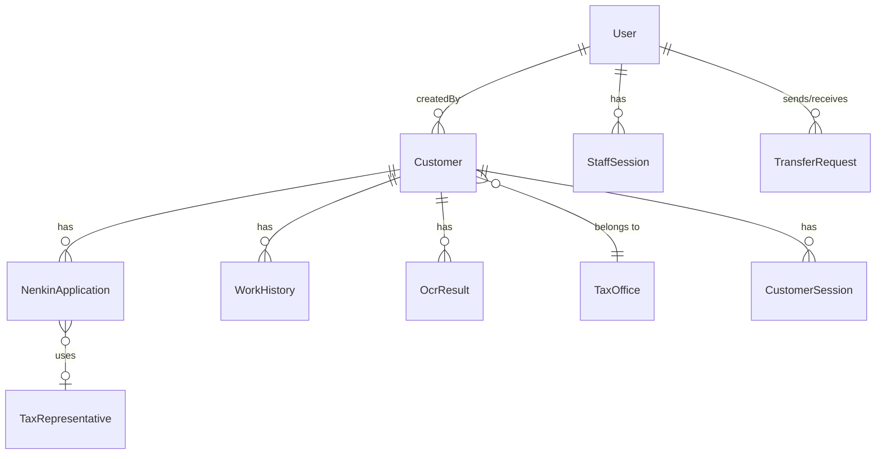
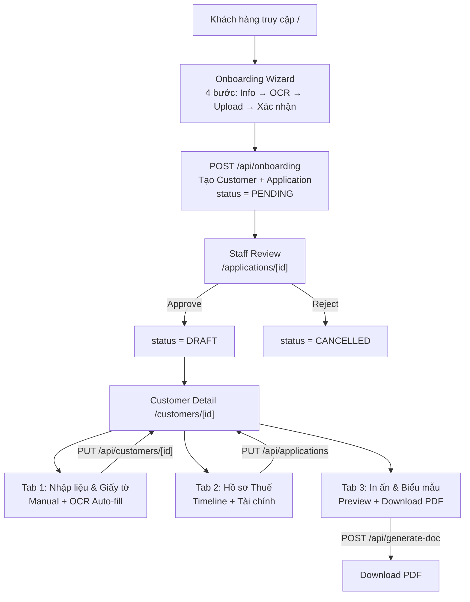

# 📋 NenkinPro — Đánh giá toàn diện dự án

> **Ngày đánh giá**: 2026-07-17  
> **Phiên bản**: commit `213b8c6` on `main`  
> **Đánh giá bởi**: AN (Antigravity)

---

## 1. Kiến trúc hệ thống

### Tech Stack
| Layer | Technology |
|---|---|
| Framework | Next.js 16.2.6 (App Router, Turbopack) |
| Database | PostgreSQL (Prisma ORM) |
| Auth | Cookie-based sessions (Staff + Customer Portal) |
| PDF | pdf-lib (server) + react-pdf (preview) |
| Font | Be Vietnam Pro + JetBrains Mono + Noto Sans JP |
| UI | Tailwind CSS, Recharts |

### Database Schema (10 models)



### Routes Overview

| Nhóm | Routes | Trạng thái |
|---|---|---|
| **Public** | `/`, `/onboarding`, `/login` | ✅ Hoạt động |
| **Staff** | `/dashboard`, `/customers`, `/customers/[id]`, `/applications`, `/applications/[id]`, `/tax-offices`, `/hr`, `/admin/pdf-mapper` | ✅ Hoạt động |
| **Portal** | `/portal/login`, `/portal/dashboard` | ✅ Hoạt động |
| **Stub** | `/finance` (651B placeholder) | ⚠️ Chưa phát triển |
| **Hub** | `/settings` (links tới sub-pages) | ✅ Cơ bản |

---

## 2. Luồng nghiệp vụ



> [!TIP]
> Luồng nghiệp vụ tổng thể **đã phù hợp** với quy trình thực tế: Tiếp nhận → Nhập liệu → Xử lý hồ sơ → In biểu mẫu → Theo dõi tiến trình. Tab 3 "In ấn" là điểm cuối của flow data.

---

## 3. Phân tích GAP: Database ↔ Form ↔ MockData ↔ PDF Tags

### 3.1 Ma trận Coverage — Thông tin cá nhân

| Trường | DB Column | Form Input | MockData Key | PDF Tag (JSON) | Đánh giá |
|---|---|---|---|---|---|
| Họ tên (Romaji) | `Customer.fullName` ✅ | ✅ Tab 1 | `fullName` ✅ | `fullName` ✅ | ✅ **ĐẦY ĐỦ** |
| Họ tên (Furigana) | `Customer.fullNameFurigana` ✅ | ✅ Tab 1 | `fullNameFurigana` ✅ | `fullName_kata` ⚠️ alias | ✅ Có alias |
| Họ / Tên riêng | `Customer.lastName/firstName` ✅ | ❌ **THIẾU** | `lastName/firstName` ✅ | Chưa dùng trong JSON | 🟡 Thiếu form |
| Ngày sinh | `Customer.dob` ✅ | ✅ Tab 1 | `dob_y/m/d` ✅ | `dob_y_1~4, dob_m_1~2...` ✅ | ✅ **ĐẦY ĐỦ** |
| **Giới tính** | `Customer.sex` ✅ | ❌ **THIẾU** | `sex` ✅ | `sex_M_mark/sex_F_mark` (cần) | 🔴 **CRITICAL** |
| **Quốc tịch** | `Customer.nationality` ✅ | ❌ **THIẾU** | `nationality` ✅ | Cần cho don_xin | 🔴 **CRITICAL** |
| **Nghề nghiệp** | `Customer.occupation` ✅ | ❌ **THIẾU** | `occupation` ✅ | Cần cho don_xin | 🔴 **CRITICAL** |
| **Chủ hộ** | `Customer.headOfHouseholdName` ✅ | ❌ **THIẾU** | `headOfHouseholdName` ✅ | Cần cho don_xin | 🟡 Thiếu form |
| **Quan hệ chủ hộ** | `Customer.relationshipToHead` ✅ | ❌ **THIẾU** | `relationshipToHead` ✅ | Cần cho don_xin | 🟡 Thiếu form |
| Mã số cá nhân | `Customer.myNumber` ✅ | ✅ Tab 1 | `myNumber` + splits ✅ | `my_num_1~12` (cần) | ✅ **ĐẦY ĐỦ** |
| Số Nenkin | `Customer.nenkinNumber` ✅ | ✅ Tab 1 | `nenkinNumber` + splits ✅ | `nenkin_1~10` ✅ | ✅ **ĐẦY ĐỦ** |
| **Số điện thoại** | `Customer.phone` ✅ | ❌ **THIẾU** (chỉ ở onboarding) | `phone` ✅ | `phone_1~11` (cần) | 🔴 **CRITICAL** |
| Nơi sinh | `Customer.placeOfBirth` ✅ | ❌ **THIẾU** | Không có mock | Chưa dùng | 🟡 Thiếu form |

### 3.2 Ma trận Coverage — Địa chỉ & Cư trú

| Trường | DB Column | Form Input | MockData Key | PDF Tag | Đánh giá |
|---|---|---|---|---|---|
| Mã bưu điện JP | `Customer.postalCode` ✅ | ✅ Tab 1 | `postalCodeFormat` ⚠️ | `post_1~7` ✅ | ✅ Có (naming khác) |
| Địa chỉ JP | `Customer.zairyuAddress` ✅ | ✅ Tab 1 | `address` ⚠️ alias `address_jp` | `address`/`address_jp` ✅ | ✅ Có alias |
| **Thường trú** | `Customer.hasPermanentResidence` ✅ | ❌ **THIẾU** | `permRes_YES/NO_mark` ✅ | Cần cho don_xin | 🟡 Thiếu form |
| **Ngày cấp thường trú** | `Customer.permanentResidenceDate` ✅ | ❌ **THIẾU** | `permResDate_y/m/d` ✅ | Cần | 🟡 Thiếu form |
| **Ngày rời Nhật** | `Customer.departureDate` ✅ | ❌ **THIẾU** | `departureDate_y/m/d` ✅ | `departure_y/m/d` ⚠️ naming | 🔴 **CRITICAL** |
| Địa chỉ VN (Tỉnh) | `Customer.overseasProvince` ✅ | ✅ Tab 1 | `overseasProvince` ✅ | Chưa map | ✅ Có input |
| Địa chỉ VN (Huyện) | `Customer.overseasCity` ✅ | ✅ Tab 1 | `overseasCity` ✅ | Chưa map | ✅ Có input |
| Địa chỉ VN (Đường) | `Customer.overseasStreet` ✅ | ✅ Tab 1 | `overseasStreet` ✅ | Chưa map | ✅ Có input |
| **Quốc gia (VN)** | `Customer.overseasCountry` ✅ | ❌ **THIẾU** | `overseasCountry` ✅ | Cần | 🟡 Thiếu form |
| **Mã BĐ nước ngoài** | `Customer.overseasPostalCode` ✅ | ❌ **THIẾU** | `overseasPostalCode` ✅ | Cần | 🟡 Thiếu form |

### 3.3 Ma trận Coverage — Ngân hàng

| Trường | DB Column | Form Input | MockData Key | PDF Tag | Đánh giá |
|---|---|---|---|---|---|
| Tên NH | `Customer.bankName` ✅ | ✅ Tab 1 | `bankName` ✅ | `bank_name` ⚠️ alias | ✅ Có alias |
| Chi nhánh | `Customer.branchName` ✅ | ✅ Tab 1 | `branchName` ✅ | `bank_branch` ⚠️ alias | ✅ Có alias |
| Số TK | `Customer.accountNumber` ✅ | ✅ Tab 1 | `accountNumber` ✅ | `bank_1~7` ✅ | ✅ **ĐẦY ĐỦ** |
| Tên chủ TK | `Customer.accountName` ✅ | ✅ Tab 1 | `accountName` ✅ | `bank_account_name` ⚠️ alias | ✅ Có alias |
| SWIFT | `Customer.swiftCode` ✅ | ✅ Tab 1 | `swiftCode` ✅ | `swift_1~11` (cần) | ✅ Có |
| **Tên TK Katakana** | `Customer.accountNameKatakana` ✅ | ❌ **THIẾU** | `accountNameKatakana` ✅ | Cần cho don_xin | 🟡 Thiếu form |
| **ĐC chi nhánh** | `Customer.bankBranchAddress` ✅ | ❌ **THIẾU** | `bankBranchAddress` ✅ | Cần | 🟡 Thiếu form |
| **Quốc gia NH** | `Customer.bankCountry` ✅ | ❌ **THIẾU** | `bankCountry` ✅ | Cần | 🟡 Thiếu form |
| **Loại TK** | ❌ Không có DB column | ❌ | ❌ | `bank_account_type` 🔴 | 🔴 Thiếu hoàn toàn |

### 3.4 Ma trận Coverage — Thuế & Tài chính

| Trường | DB Column | Form Input | MockData Key | PDF Tag | Đánh giá |
|---|---|---|---|---|---|
| Dự kiến nhận | `App.totalExpectedJpy` ✅ | ✅ Tab 2 | `totalExpectedJpy` ✅ | ✅ | ✅ **ĐẦY ĐỦ** |
| Thuế khấu trừ | `App.withheldTax` ✅ | ⚠️ Auto-calc | `withheldTax` ✅ | ✅ | ✅ Computed |
| **Năm khai thuế** | `App.taxYear` ✅ | ❌ **THIẾU** | `taxYear_era_yr` ✅ | ✅ bang_1_2, bang_3 | 🔴 **CRITICAL** |
| **Hoàn thuế** | ❌ Không có DB | ❌ | `refundAmount` ✅ | ✅ bang_1_2, bang_3 | 🟡 Computed |
| **Khấu trừ hưu trí** | ❌ Không có DB | ❌ | `retirementDeductionAmount` ✅ | ✅ bang_3 | 🟡 Computed |
| **Thu nhập chịu thuế** | ❌ Không có DB | ❌ | `taxableRetirementIncome` ✅ | Cần | 🟡 Computed |
| **Thuế tính** | ❌ Không có DB | ❌ | `calculatedTax` ✅ | Cần | 🟡 Computed |
| Ngày nộp | `App.applyDate` ✅ | ✅ Tab 2 | `applyDate_y/m/d` ✅ | `applyDate_*` (cần) | ✅ |

### 3.5 Ma trận Coverage — Naming Mismatch trong PDF Tags

| JSON Config dùng | TAG_GROUPS dùng | MockData | Tình trạng |
|---|---|---|---|
| `address_jp` | `address` | alias ✅ | ⚠️ JSON ≠ TAG_GROUPS |
| `fullName_kata` | `fullNameFurigana` | alias ✅ | ⚠️ JSON ≠ TAG_GROUPS |
| `bank_name` | `bankName` | alias ✅ | ⚠️ JSON ≠ TAG_GROUPS |
| `bank_branch` | `branchName` | alias ✅ | ⚠️ JSON ≠ TAG_GROUPS |
| `bank_account_name` | `accountName` | alias ✅ | ⚠️ JSON ≠ TAG_GROUPS |
| `work_company_1` | `workHistory_1_companyName` | ❌ thiếu alias | 🔴 **Không khớp** |
| `departure_y_1~4` | `departureDate_y_1~4` | ❌ thiếu alias | 🔴 **Không khớp** |
| `today_era_jp/yr/m/d` | ❌ Không có trong TAG_GROUPS | ❌ thiếu mock | 🔴 **Hoàn toàn thiếu** |
| `doc_date_era_jp/yr/m/d` | ❌ Không có trong TAG_GROUPS | ❌ thiếu mock | 🔴 **Hoàn toàn thiếu** |
| `bank_account_type` | ❌ Không có trong TAG_GROUPS | ❌ thiếu mock | 🔴 **Hoàn toàn thiếu** |

---

## 4. Tóm tắt vấn đề theo mức độ

### 🔴 CRITICAL — Thiếu form input (biểu mẫu in sẽ trống)

| # | Trường | Biểu mẫu cần | Giải pháp |
|---|---|---|---|
| 1 | `sex` (Giới tính) | don_xin_lan_1 | Thêm radio Nam/Nữ vào Customer form |
| 2 | `nationality` (Quốc tịch) | don_xin_lan_1 | Thêm input text |
| 3 | `phone` (SĐT) | don_xin_lan_1 | Thêm input vào Customer Detail (đã có ở onboarding nhưng thiếu ở form chỉnh sửa) |
| 4 | `occupation` (Nghề nghiệp) | don_xin_lan_1 | Thêm input text |
| 5 | `departureDate` (Ngày rời Nhật) | nouzeikanrinin, giay_uy_thac, bang_3 | Thêm date input |
| 6 | `taxYear` (Năm khai thuế) | bang_1_2, bang_3 | Thêm number input vào AppDetailsTab |

### 🟡 IMPORTANT — Thiếu form nhưng không block

| # | Trường | Giải pháp |
|---|---|---|
| 7 | `headOfHouseholdName` + `relationshipToHead` | Thêm 2 input vào Customer form |
| 8 | `hasPermanentResidence` + `permanentResidenceDate` | Thêm toggle + date |
| 9 | `overseasCountry` + `overseasPostalCode` | Thêm input vào VN address section |
| 10 | `accountNameKatakana` | Thêm input vào Bank section |
| 11 | `bankBranchAddress` + `bankCountry` | Thêm input vào Bank section |
| 12 | `placeOfBirth` | Thêm input |
| 13 | Work history `pensionType` | Thêm select vào work history form |

### 🔵 NAMING MISMATCH — Cần thống nhất

| # | Vấn đề | Giải pháp |
|---|---|---|
| 14 | `today_*` / `doc_date_*` không có trong TAG_GROUPS | Thêm tags mới hoặc dùng auto-fill (ngày hiện tại) |
| 15 | `work_company_1` ≠ `workHistory_1_companyName` | Thêm aliases vào mockData + documentMapper |
| 16 | `departure_*` ≠ `departureDate_*` | Thêm aliases |
| 17 | `bank_account_type` không có DB column lẫn TAG | Thêm field vào DB + form + TAG_GROUPS |

### ⚪ COMPUTED VALUES — Cần logic tính toán

| # | Trường | Giải pháp |
|---|---|---|
| 18 | `retirementDeductionAmount` | Tính từ workYears (40万 × 年数) |
| 19 | `taxableRetirementIncome` | `(totalExpected - deduction) / 2` |
| 20 | `calculatedTax` | Tra bảng thuế thu nhập |
| 21 | `refundAmount` | `withheldTax - calculatedTax` |

---

## 5. Sprint Status

| Sprint | Nội dung | Trạng thái | Hoàn thành |
|---|---|---|---|
| Sprint 1 | Foundation & Design System | ✅ DONE | 100% |
| Sprint 2 | Customer Management + OCR | ✅ DONE | 100% |
| Sprint 3 | Application Workflow | ✅ DONE | 100% |
| Sprint 4 | PDF Form Generator | ⚡ ĐANG LÀM | ~70% |
| Sprint 5 | Finance & Reporting | ❌ CHƯA | 0% |
| Sprint 6 | HR, Admin & Portal | 🔶 MỘT PHẦN | ~50% |

---

## 6. Đề xuất bước tiếp theo

### Phase A: Hoàn thiện Sprint 4 (PDF Forms) — Ưu tiên cao nhất

> [!IMPORTANT]
> **Mục tiêu**: Tất cả 6 biểu mẫu in ra đầy đủ nội dung, không trống trường nào.

1. **Bổ sung form input** cho 6 trường CRITICAL (#1-#6 ở trên) vào `Customer Detail` Tab 1
2. **Bổ sung form input** cho 7 trường IMPORTANT (#7-#13) 
3. **Thống nhất naming** trong JSON configs, TAG_GROUPS, và mockData (#14-#17)
4. **Thêm logic computed values** cho 4 trường tính thuế (#18-#21) vào `documentMapper.ts`
5. **Thêm tags mới** vào TAG_GROUPS: `today_*`, `doc_date_*`, `bank_account_type`
6. **Test toàn bộ** 6 templates với mock data đầy đủ

### Phase B: Sprint 5 — Finance & Reporting

7. Xây dựng trang `/finance` (hiện là stub)
8. Dashboard tài chính: tổng thu, tổng chi, hoa hồng
9. Báo cáo xuất Excel/CSV

### Phase C: Sprint 6 — Admin & Portal Enhancement

10. Auth middleware (hiện không có — frontend routes không được bảo vệ)
11. Portal khách hàng: xem trạng thái chi tiết hơn
12. Quản lý tỷ giá thực tế (hiện dashboard dùng mock data cho biểu đồ doanh thu)

---

## 7. Cấu trúc dự án (Tham khảo)

```
nenkin/
├── prisma/
│   └── schema.prisma              # 10 models, PostgreSQL
├── public/
│   ├── forms/                     # 10 PDF templates
│   ├── templates/                 # 6 JSON mapping configs
│   ├── fonts/                     # Noto Sans JP
│   └── cmaps/                     # PDF.js CMap files
├── src/
│   ├── app/
│   │   ├── page.tsx               # Landing page
│   │   ├── login/                 # Staff login
│   │   ├── onboarding/            # 4-step wizard
│   │   ├── dashboard/             # KPI + Charts
│   │   ├── customers/             # CRUD + 3-tab detail
│   │   │   └── [id]/
│   │   │       ├── page.tsx       # Tab 1: Nhập liệu
│   │   │       ├── AppDetailsTab  # Tab 2: Hồ sơ thuế
│   │   │       └── PrintTab.tsx   # Tab 3: In biểu mẫu
│   │   ├── applications/          # List + Detail + Print
│   │   ├── admin/pdf-mapper/      # PDF Mapping Studio
│   │   ├── tax-offices/           # Tax Office CRUD
│   │   ├── hr/                    # Staff management
│   │   ├── finance/               # STUB
│   │   ├── settings/              # Hub
│   │   ├── portal/                # Customer portal
│   │   └── api/                   # 18+ API endpoints
│   ├── components/
│   │   ├── PrintOverlay.tsx       # PrintContainer + PrintField
│   │   ├── Sidebar.tsx            # Collapsible sidebar
│   │   ├── Topbar.tsx             # Header bar
│   │   └── ui/                    # Button, Card, Input, Table
│   └── lib/
│       ├── pdfCoords.ts           # Shared PDF constants
│       ├── pdfGenerator.ts        # pdf-lib server gen
│       ├── mockData.ts            # 82+ mock keys
│       ├── documentMapper.ts      # Data → template mapping
│       └── navigation.ts          # Menu items
├── MAPPING_GUIDE.md               # Data contract docs
├── PROJECT_PROFILE.md             # Sprint planning
└── package.json
```
